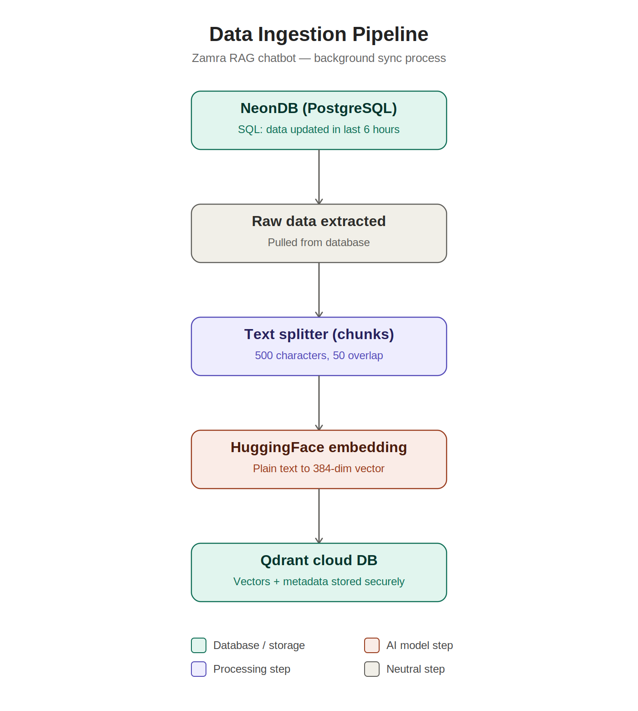
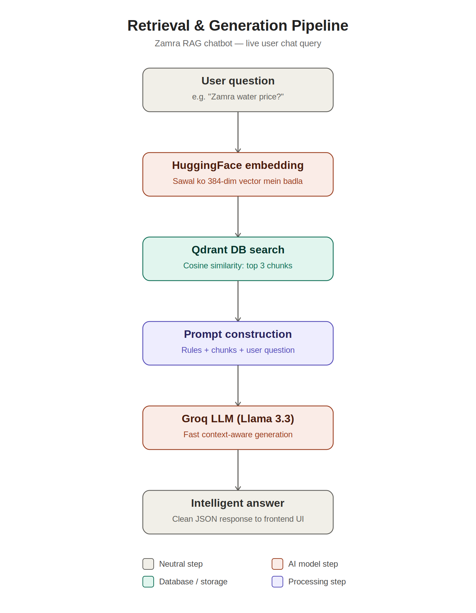

# Zamra Water Plant Backend

## Description

Zamra Water Plant Backend is a NestJS-based server application designed for a water business management platform. It powers the core business operations of Zamra, including company information, stock management, pricing, billing, authentication, and an AI-powered chatbot experience for business queries.

The backend is built to be modular, scalable, and secure, making it suitable for real-world business workflows and future expansion.

## Key Highlights

* Secure authentication and authorization using JWT
* Company, stock, pricing, and daily business data management
* REST APIs for frontend integration
* PostgreSQL database support with TypeORM
* AI chatbot support with retrieval-based knowledge handling
* Docker-ready setup for easy deployment

## Chatbot Architecture

The chatbot module uses a retrieval and ingestion pipeline to store and retrieve business knowledge from the database.





## Features

* Point of Sale (POS) Management
* Product and Stock Management
* Pricing and Daily Stock Records
* Company and Customer Information Management
* Billing and Invoice Support
* Secure Authentication (JWT)
* AI Chatbot for business assistance
* Dashboard and reporting support

## Technology Stack

* NestJS
* TypeScript
* PostgreSQL
* TypeORM
* JWT Authentication
* Docker
* LangChain / Qdrant / Hugging Face integrations for chatbot intelligence

## Project Setup

```bash
npm install
```

## Run the Project

```bash
# Development
npm run start:dev

# Production
npm run build
npm run start:prod
```

## Testing

```bash
npm run test
npm run test:e2e
npm run test:cov
```

## Future Enhancements

* Multi-branch support
* Online order and delivery tracking
* Mobile app integration
* Advanced analytics and reporting
* Expanded chatbot knowledge sources

## License

This project is developed for Zamra Water Plant and is intended for internal business operations and management.
